## Documentation Repository Structure

```mermaid
flowchart TD
    A[Root Directory] --> B(README.md)
    A --> C(CONTRIBUTING.md)
    A --> D[Project Documentation]
    A --> E[API Documentation]
    A --> F[User Guides]
    A --> G[Developer Guides]

    D --> D1[Sports Score Predictor Docs]
    D --> D2[Stock Market Simulator Docs]
    D1 --> D1A[Feature Overview - Sports]
    D1 --> D1B[System Architecture - Sports]
    D1 --> D1C[Workflow Descriptions - Sports]
    D2 --> D2A[Feature Overview - Stock]
    D2 --> D2B[System Architecture - Stock]
    D2 --> D2C[Workflow Descriptions - Stock]

    E --> E1[Common API Docs]
    E --> E2[App-Specific API Docs]
    E1 --> E1A[Endpoint Descriptions]
    E1 --> E1B[Usage Examples]
    E2 --> E2A[Sports Predictor API]
    E2 --> E2B[Stock Simulator API]

    F --> F1[End-User Manuals]
    F --> F2[FAQs]
    F1 --> F1A[Installation Guide]
    F1 --> F1B[Usage Instructions]
    F2 --> F2A[General Questions]
    F2 --> F2B[Troubleshooting]

    G --> G1[Technical Setup Guides]
    G --> G2[Code Style and Standards]
    G1 --> G1A[Environment Setup]
    G1 --> G1B[Build Instructions]
    G2 --> G2A[Formatting Guidelines]
    G2 --> G2B[Best Practices]

```

#### Root Directory
- `README.md`: Overview of the repository and navigation help.
- `CONTRIBUTING.md`: General contribution guidelines.
- `.gitignore`: Standard Git ignore file.

#### Project Documentation
- `/Project Documentation`
  - `Sports Score Predictor Docs`: Documentation specific to the Sports Score Predictor app.
  - `Stock Market Simulator Docs`: Documentation specific to the Stock Market Simulator app.

#### API Documentation
- `/API Documentation`
  - `Common API Docs`: Documentation for APIs used across both apps.
  - `App-Specific API Docs`: Separate documentation for APIs specific to each app.

#### User Guides
- `/User Guides`
  - `End-User Manuals`: Manuals and guides for end-users of the apps.
  - `FAQs`: Frequently Asked Questions and their answers.

#### Developer Guides
- `/Developer Guides`
  - `Technical Setup Guides`: Instructions and guides for setting up development environments.
  - `Code Style and Standards`: Guidelines for code style and best practices.

### Documentation Focus
- **Comprehensive Coverage**: Ensure all aspects of both apps are thoroughly documented.
- **Accessibility**: Make documentation easy to navigate and understand.
- **Consistency**: Maintain a consistent style and format across all documents.

### Versioning and Updates
- Regularly update documentation to reflect the latest changes in the projects.
- Use version control to track changes and updates to the documentation.

### Collaboration and Contribution
- Encourage contributions to the documentation from team members.
- Set clear guidelines for how to contribute to ensure consistency and quality.
