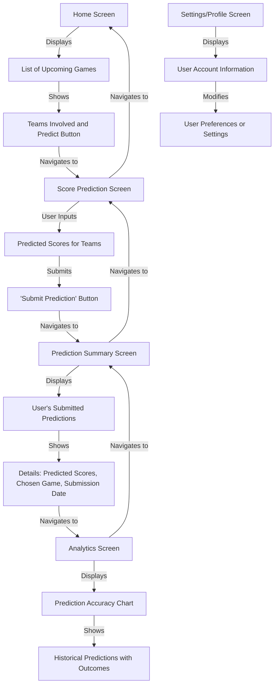

# Sports Score Predictor App Wireframes

## Wireframe Mermaid Graph

## Home Screen:
- A list of upcoming sports games (e.g., NFL games).
- Each list item shows teams involved and a button to predict the score.

## Score Prediction Screen:
- A screen for entering predicted scores for a selected game.
- Options to input scores for each team.
- A 'Submit Prediction' button.

## Prediction Summary Screen:
- Shows the user's submitted predictions.
- Includes details like predicted scores, chosen game, and submission date.
- A 'View Analytics' button to see prediction statistics.

## Analytics Screen:
- Displays user's prediction accuracy over time in a chart.
- Lists historical predictions with outcomes.

## Settings/Profile Screen:
- User account information.
- Options to modify user preferences or settings.

# Stock Market Simulator App Wireframes
## Wireframe

```mermaid
flowchart LR
    A[Home/Dashboard Screen] -->|Displays| A1[User's Virtual Portfolio Summary]
    A -->|Shows| A2[Current Value, Gains/Losses]
    A -->|Shows| A3[Basic Analytics]

    B[Stock Search and Selection Screen] -->|Features| B1[Search Bar for S&P 500 Stocks]
    B -->|Displays| B2[Stock Details]
    B -->|Displays| B3[Historical Performance]
    B --> A

    C[Trade Execution Screen] -->|Provides| C1[Buy/Sell Options]
    C -->|Includes| C2[Input Fields for Quantity]
    C -->|Includes| C3[Order Type Selection &#40;Market, Limit, etc.&#41;]
    C --> A

    D[Portfolio Management Screen] -->|Shows| D1[Detailed View of Stock Holdings]
    D -->|Includes| D2[Performance Charts]
    D -->|Includes| D3[Transaction History]
    D --> A

    E[Projection and Learning Screen] -->|Features| E1[Interactive Tools for Price Projection]
    E -->|Includes| E2[Educational Content and Tips]
    E -->|Includes| E3[Guides for Beginners]
    E --> A

    F[Settings/Profile Screen] -->|Similar to| F1[Sports Score Predictor App for Consistency]
    F --> A
```

## Home/Dashboard Screen:
- Displays a summary of the user's virtual portfolio.
- Shows current value, gains/losses, and basic analytics.

## Stock Search and Selection Screen:
- A search bar to find and select stocks from the S&P 500.
- Display of stock details and historical performance.

## Trade Execution Screen:
- Options to buy/sell the selected stock.
- Input fields for quantity and order type (market, limit, etc.).

## Portfolio Management Screen:
- Detailed view of the user’s stock holdings.
- Performance charts and transaction history.

## Projection and Learning Screen:
- Interactive tools for projecting future stock prices.
- Educational content, tips, and basic guides for beginners.

## Settings/Profile Screen:
- Similar to the Sports Score Predictor app, for consistency.

# General Wireframe Considerations
- Navigation: Both apps should have a bottom navigation bar for quick access to the main screens (e.g., Home, Analytics/Portfolio, Settings).
- User Interaction: Ensure screens are designed for ease of use, with clear, large, and accessible touch targets.
- Aesthetics: Maintain a consistent color scheme and typography that aligns with the app’s branding.
- Feedback Mechanisms: Include loading indicators, success/error messages, and confirmations for user actions.
