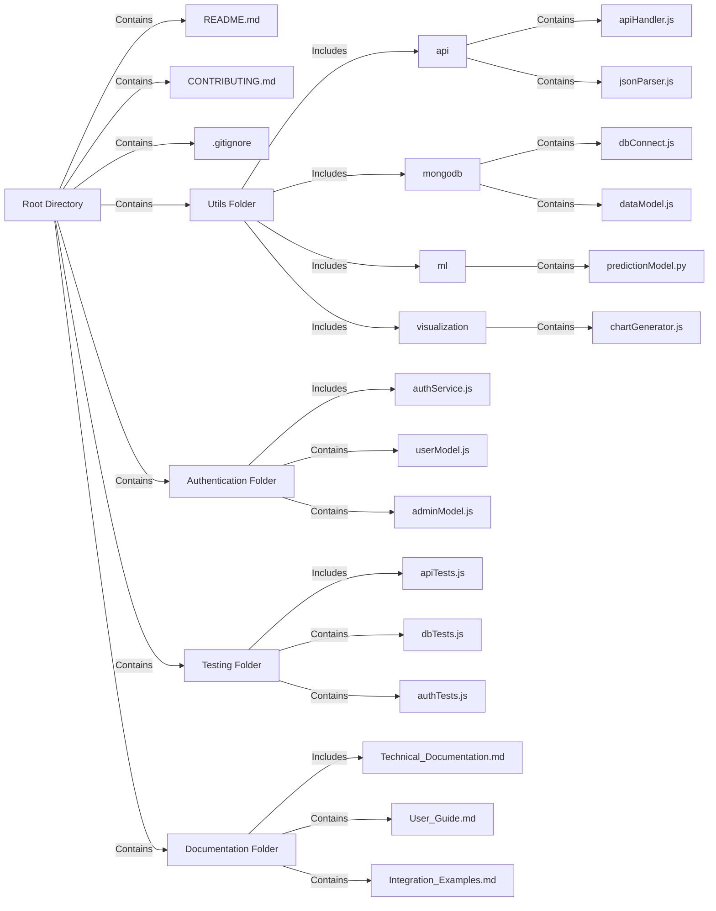

## Shared Library Repository Structure

## Root Directory
- `README.md`: Project description and guidelines.
- `CONTRIBUTING.md`: Contribution guidelines.
- `.gitignore`: Standard Git ignore file.

## Utils Folder
- `/utils/api`: Common API methods.
  - `apiHandler.js`: API request handler.
  - `jsonParser.js`: JSON parsing utility.
- `/utils/mongodb`: MongoDB processing methods.
  - `dbConnect.js`: Database connection script.
  - `dataModel.js`: Data models and schemas.
- `/utils/ml`: Machine learning tools.
  - `predictionModel.py`: ML model for predictions.
- `/utils/visualization`: Visualization tools.
  - `chartGenerator.js`: Chart and graph generator.

### Authentication Folder
- `/auth`
  - `authService.js`: Authentication service.
  - `userModel.js`: User model.
  - `adminModel.js`: Admin model.

### Testing Folder
- `/tests`
  - `apiTests.js`: API utility tests.
  - `dbTests.js`: Database interaction tests.
  - `authTests.js`: Authentication tests.

### Documentation Folder
- `/docs`
  - `Technical_Documentation.md`: Technical docs.
  - `User_Guide.md`: User guide.
  - `Integration_Examples.md`: Integration examples.

## Development and Versioning
- Use Git for version control.
- Tag releases with semantic versioning.
- Update `CHANGELOG.md` regularly.

## Documentation
- **Technical Documentation**: Descriptions and usage of utilities.
- **User Guide**: Overview and user instructions.
- **Contribution Guidelines**: How to contribute and coding standards.
